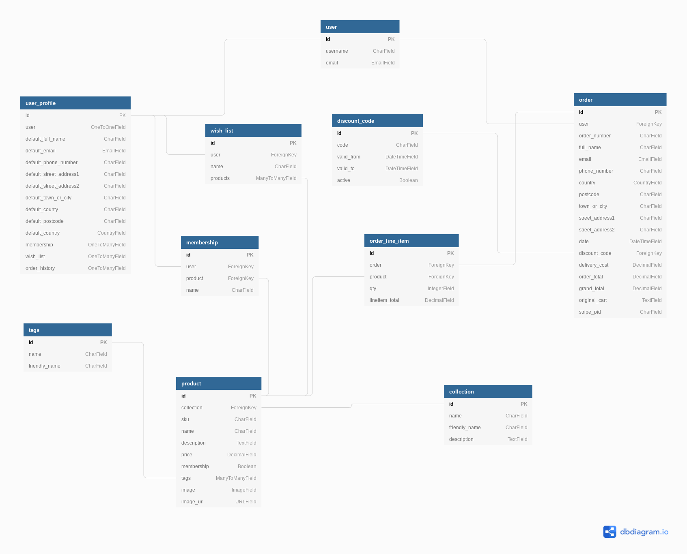

# Piratini Coffee Roasters Data Model

## Overview

Being a e-commerce app, a relational database fits the endeavour perfectly due to the many relationships between entities and the complexity of the data being handled. For development, SQLite was used as a default database - this was changed to Postgres during production and deployment to Heroku.


## Models
---

### User Models

#### user

> - The **user** model is the representation of the shopper - either the one-time shopper who comes in to the website and buys products without logging-in, but also the user who has a profile and login registered on the database. This entity is related to the **user_profile** model via an One-to-one connection. It is also connected to the **order** model, establishing a one-to-many relationship (an user may have may orders, but an order can only belong to an user).
>

#### user_profile

> - The **user_profile** entity models the profile created by the **user** entity and describes the *default* information of the user, such as full name, email and phone number. This model is connected to many other entities, modelling relationships in the format of "lists": the **wish_list** model is the perfect example of this. While an user can have many lists (where they can favourite products), a list can only belong to one user, describing a One-to-many relationship. This model is also connected to the entities **membership** and **order** via the same relationship (one-to-many).
>

#### Order Models

#### order

> - This model holds information about the order created by the shopper, once they go through checkout - it is arguably one of the most important models since it keeps data about the **user** who created it, shipping information and can be *tracked*. It is connected to the **user** model via Foreign Key, on a one-to-many relationship (an user may have many orders, but an order can only belong to one user). It has also a one-to-many relationship with the **discount_code** entity: this is limited by one discount code by order, which means that an order can only have one discount code whereas a discount code can be in many orders.
>


#### order_line_item

> - This entity is the stepping stone that connects **products** to the **order** model - it describes items *belonging* to an order and serves as a vehicle to qualify which products are in that order and to quantify the product. It is connected to the **product** model via an one-to-one relationship (it can only be one product per order line item, and an order line item can only qualify one product). It is connected to the **order** model via a one-to-many relationship (an order line item can only belong to an order, but an order can have many order line items).
>

### Product Models

#### product

> - As the **order** model and the **user** model, this entity is one of the pillars of the entire database, as it models the physical products available for sale on the website and has essential information, such as name, description of the product and unitary price. The relationship with the **collections** model is descriptive as it only categorises products in different collections; the connection is established via one-to-many (a product can only be in one category, but categories can have multiple products). This model is also connected to the **order_line_item** as an one-to-one relationship which serves as a *bridge* to the **order** model. As a final connection, **products** relate to tags on a many-to-many relationship (a product can have many tags, and a tag can belong to many products).
>

#### membership

> - This entity is a *type* of product, as inherits characteristics from the **product** model and it is connected via an one-to-one relationship (if the field *membership* is defined ```True```, then the **product** will relate to this entity). This model tracks the *number* of the subscription, that is connected to the **user** model via Foreign Key - it is the bridge between a **product** of *membership type* to the **user** who owns it; therefore, it is a many-to-one relationship (a membership can only belong to an user, but an user may have different types of memberships). 

### Other Models

#### collection

> - This entity is a descriptive model, as it serves as *buckets* for **products**: as an analogy, this would the aisle where the product would be stored if this was a physical shop. It aids to sort **products** in different categories and provides a better UX for shoppers who are interested in one particular collection.
>

#### tags

> - This model refers to the key-words connected to which **product** (via a many-to-many relationship) to aid search and sorting, together with classifying items on another *dimension* of buckets: using the tag #new-products, for instance, would classify them by *time on the platform*, rather than collections of products.
>

#### wish_list

> - This entity is a list of products shortlisted by the **user**, and it serves as a shopping list for the shopper. It connects to the user via Foreign Key, establishing a one-to-many relationship (an **user** may have several wish lists, but a **wish_list** can only belong to an user). The relationship with the **product**  model is established via ForeignKey, on a many-to-many relationship (products can belong to several wish lists, and wish lists can have many products).
>

#### discount_code

> - This model keeps information regarding the discount codes that are applicable on checkout, and it is connected to the **order** model via Foreign Key, on a one-to-many relationship (an order is limited to have **only one** discount code, whereas discount codes can be applied to many orders). This entity *affects* the order, as it applies a discount percentage on the *grand_total* field of the **order** model.
>

## Data Schema
---
> - 
